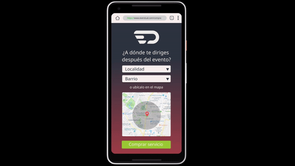

<!-- icons -->

[1.1]: http://i.imgur.com/tXSoThF.png (twitter icon with padding)
[1]: https://twitter.com/ieu_un

<h1 align="center">Evendual</h1>

### If you like the project, please give it a star ⭐ It will show the creators your appreciation and help others to discover the repo.

# ✍️ About 

**Evendual, is a temporary (in spanish 'Eventual') public transport system to reduce the saturation in the TransMilenio stations to the exit of massive events in the city of Bogotá.**

Please visit the [executive summary](https://github.com/dfzunigah/Evendual/blob/master/Executive%20summary%20%5BES%5D.pdf) and [the proposal](https://github.com/dfzunigah/Evendual/blob/master/EVENDUAL.pdf) to learn more. Also, you can see a demo we did in the [demo folder](https://github.com/dfzunigah/Evendual/tree/master/demo).

⚠️Warning: GitHub may not display pdf files correctly. Download them for a better experience.⚠️

This project was part of the first version of 'Taller Bogotá TBOG', a initiative by the Universidad Nacional de Colombia to get undergraduate students closer to real world problems in the context of the 4.0 industrial revolution.

For more about 'Taller Bogotá TBOG', follow the Instituto de Estudios Urbanos (Urban Studies Institute) on [![@ieu_un][1.1]][1]

## On the news

- [[Radio 📻] Taller Bogotá: soluciones concretas a los problemas de la ciudad](http://unradio.unal.edu.co/nc/detalle/cat/observatorio-de-gobierno-urbano/article/taller-bogota-soluciones-concretas-a-los-problemas-de-la-ciudad.html)
- [Evendual, iniciativa de estudiantes UN para descongestionar Transmilenio en eventos masivos](http://ieu.unal.edu.co/noticias-del-ieu/item/evendual-iniciativa-de-estudiantes-un-para-descongestionar-transmilenio-en-eventos-masivos)
- [Concluyó el Taller Bogotá con seis propuesta para la ciudad](http://ieu.unal.edu.co/noticias-del-ieu/item/concluyo-el-taller-bogota-con-seis-propuestas-para-la-ciudad)
- [Propuestas de espacio público y movilidad fueron presentadas en el Taller Bogotá](http://ieu.unal.edu.co/noticias-del-ieu/item/propuestas-de-espacio-publico-y-movilidad-fueron-presentadas-en-el-taller-bogota)
- [Estudiantes de Taller Bogotá presentan primeras alternativas e solución a los retos de la ciudad](http://ieu.unal.edu.co/noticias-del-ieu/item/estudiantes-de-taller-bogota-presentan-primeras-alternativas-de-solucion-a-los-retos-de-la-cidudad)
- [Taller Bogotá: Una cátedra para la ciudad](https://agenciadenoticias.unal.edu.co/detalle/article/taller-bogota-una-catedra-para-la-ciudad.html)

# 📺 Demo 

# 👨‍💻 Creators

- [Leonardo Murillo]()
- [Santiago Sanchez](https://linkedin.com/in/andrés-santiago-sánchez-peña-269192176)
- [Daniel Zuñiga](https://linkedin.com/in/dfzunigah)
